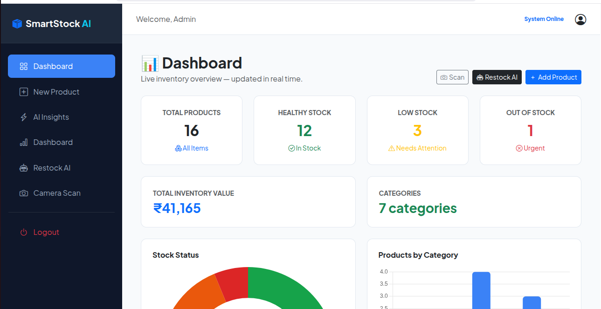

# SmartStock AI

AI-powered inventory management system built with Spring Boot + FastAPI.

## Live Demo
https://inventory-app-production-e66a.up.railway.app
Login: admin / admin

## Screenshot


## Features
- AI Camera Scan - point camera at product, AI identifies it instantly
- Restock Advisor - AI recommends reorder quantities  
- Live Dashboard - real-time charts and stock levels
- Low Stock Alerts - automatic flagging below threshold
- Export Reports - download inventory data

## Tech Stack
- Backend: Java 17, Spring Boot 3, Spring Security
- Frontend: Thymeleaf, Bootstrap 5, Chart.js
- Database: PostgreSQL
- AI Service: Python 3, FastAPI
- Deployed: Railway + Render
- Uptime: UptimeRobot monitoring

## Run Locally
```bash
# Start Python AI service
cd smartstock-ai-service
pip install -r requirements.txt
python ai_service.py

# Start Spring Boot (separate terminal)
cd inventory
./mvnw spring-boot:run
```

## Architecture
Browser → Spring Boot (Railway) → FastAPI AI Service (Render)
                    ↓
              PostgreSQL DB
